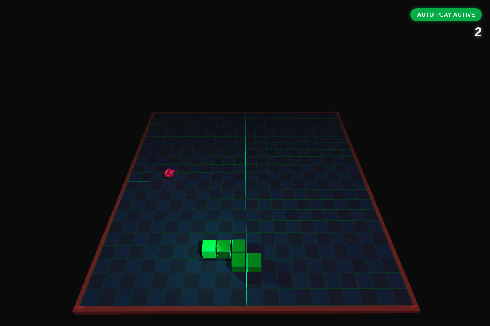

# 🐍 3D Snake Game

A neon-drenched, auto-playing 3D Snake game built with **Three.js**. Watch the AI dominate, then take control and see how far you can go.




## ✨ Features

- **Auto-Play AI** — Watch the snake navigate the grid autonomously, avoiding walls and itself with BFS pathfinding toward food
- **Manual Mode** — Press any arrow key to take full control instantly
- **True 3D Graphics** — Glowing cube segments, pulsating food, dynamic lighting, and subtle camera follow
- **Neon Aesthetic** — Dark theme with neon green snake, shadow effects, and animated food
- **Wrap-around Walls** — Snake wraps from one side to the other
- **Score Tracking** — Real-time score display in the UI overlay
- **Game Over Screen** — Restart button to play again instantly
- **Zero Setup** — Single HTML file, just open in a browser

## 🚀 How to Play

1. Open `index.html` in any modern browser
2. Sit back and watch the AI play
3. Press **Arrow Keys** to take manual control
4. Press **Space** to toggle auto-play back on
5. Eat food to grow, avoid crashing into yourself
6. Game over? Hit **Restart** and try again

## 🛠️ Tech Stack

| Layer | Technology |
|-------|-----------|
| 3D Rendering | [Three.js](https://threejs.org/) r128 |
| AI | BFS pathfinding + safe-move heuristic |
| Game Logic | Custom JavaScript game loop |
| Input | Keyboard event handling |
| Styling | CSS overlays & animations |

## 📂 Project Structure

```
├── index.html          # Main HTML file with UI overlay
├── styles.css          # UI styling
├── config.js           # Game configuration constants
├── renderer.js         # Three.js scene, camera, lighting, objects
├── gameLogic.js        # Snake movement, collision, food, score
├── ai.js               # Auto-play AI with BFS pathfinding
├── input.js            # Keyboard input handling
├── main.js             # Game loop and orchestration
└── plan.md             # Original design spec
```

## 🎮 Controls

| Key | Action |
|-----|--------|
| `↑` `↓` `←` `→` | Change direction (manual mode) |
| `Space` | Toggle auto-play |
| `Restart Button` | Reset game |

## 🔧 Customization

Edit `config.js` to adjust:

- **Grid size** (`GRID_SIZE`)
- **Move interval** (`MOVE_INTERVAL`)
- **Snake speed** (in config)
- **Colors** for snake, food, background, walls
- **Lighting intensity and position**

## 📝 Development

This is a standalone project with no build step or bundler required.

```bash
# Just open the HTML file in a browser
open index.html
```

For development with a local server (recommended for module loading):

```bash
npx serve .
```

## 🤖 Auto-Play AI

The AI uses a simple but effective strategy:

1. **BFS pathfinding** to find the shortest path to food
2. If a safe path exists, follow it
3. If multiple safe moves exist, prefer the one closest to food
4. If trapped, game over — the snake can't avoid death forever

## 📜 License

MIT

---

**Built with ❤️ and Three.js** — *Sit back, watch the AI, then take the wheel.*
